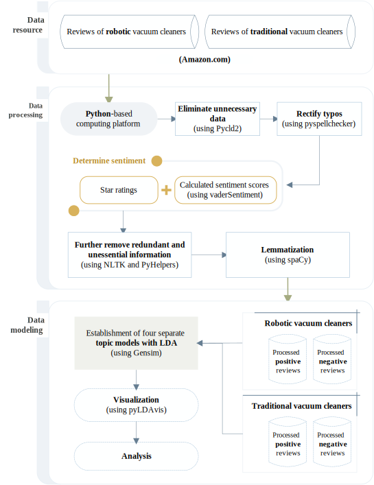

Understanding user experience using text mining & analysis
==========================================================

A case study of Amazon.com reviews for smart-home products - **[Technical Documentation](https://github.com/mikeqfu/smart-home-product-reviews-analysis/blob/master/docs/build/latex/smart_home_product_reviews_analysis.pdf)**

Qian Fu , Yixiu Yu , Dong Zhang 

## Introduction

This case study explores the growing use of smart home products, focusing specifically on user experiences beyond initial adoption. By analysing Amazon.com reviews of robotic vacuum cleaners, it aims to uncover the factors driving user satisfaction and dissatisfaction.

🔍 **Key insights include:**

- ✔️ **Satisfaction dimensions**: Users appreciate functionality, smart capabilities and enhanced performance.
- ❌ **Dissatisfaction dimensions**: Common issues include limited "smartness", poor customer service and functionality issues (e.g. connectivity). 

💡 Notably, **"smartness" emerges as a double-edged sword** - it contributes to satisfaction when effective, yet easily leads to disappointment when poorly implemented.

Through topic modelling and fuzzy-set qualitative comparative analysis (fsQCA), this case study demonstrates a comprehensive framework for understanding key dimensions of user experience. The methods are easily adaptable, and the insights could benefit designers and marketers across various smart home product categories, including electric vehicles (EVs), in shaping product design and strategy. 

## Methodology

<!--suppress HtmlDeprecatedAttribute -->

    

  <em>Fig. 1: Text-mining framework applied in this study. (<a href="https://doi.org/10.1080/08874417.2024.2408006">Yu, et al., 2024</a>)</em>

**For more details, please refer to the full [Technical Documentation](https://github.com/mikeqfu/smart-home-product-reviews-analysis/blob/master/docs/build/latex/smart_home_product_reviews_analysis.pdf)**.

## Publications

- [Yu, Y.](https://orcid.org/0000-0002-3481-0648), [Fu, Q.](https://orcid.org/0000-0002-6502-9934), [Zhang, D.](https://orcid.org/0000-0002-0993-207X), & [Gu, Q.](https://orcid.org/0000-0001-6049-4282) (2024). Understanding user experience with smart home products. Journal of Computer Information Systems, 1–23. [doi:10.1080/08874417.2024.2408006](https://doi.org/10.1080/08874417.2024.2408006).
- [Yu, Y.](https://orcid.org/0000-0002-3481-0648), [Fu, Q.](https://orcid.org/0000-0002-6502-9934), [Zhang, D.](https://orcid.org/0000-0002-0993-207X) & [Gu, Q.](https://orcid.org/0000-0001-6049-4282) (2024). What are smart home product users commenting on? A case study of robotic vacuums. In: Han, H., Baker, E. (eds) Next Generation Data Science. SDSC 2023. Communications in Computer and Information Science, vol 2113. Springer, Cham. [doi:10.1007/978-3-031-61816-1_3](https://doi.org/10.1007/978-3-031-61816-1_3).

## Relevant resources

- **Open-source Python packages:** [Fu, Q.](https://research.birmingham.ac.uk/en/persons/qian-fu) (2020). [PyHelpers](https://pypi.org/project/pyhelpers/): an open-source toolkit for facilitating Python users' data manipulation tasks. [doi:10.5281/zenodo.4081634](https://doi.org/10.5281/zenodo.4017438).

## Collaborators

<table>
    <tbody>
        <tr>
            <td align="center">
                <a href="https://github.com/mikeqfu" target="_blank"> <b>Qian Fu</b></a> 
                <a href="https://github.com/mikeqfu/smart-home-product-reviews-analysis/commits?author=mikeqfu" target="_blank" title="Methodology, Software">💻</a>
                <a href="https://github.com/mikeqfu/smart-home-product-reviews-analysis/tree/master/tests" target="_blank" title="Testing">🧪</a>
                <a href="https://github.com/mikeqfu/smart-home-product-reviews-analysis/tree/master/demos" target="_blank" title="Data Curation, Visualisation">📈</a>
                <a href="https://github.com/mikeqfu/smart-home-product-reviews-analysis/blob/master/docs/build/latex/smart_home_product_reviews_analysis.pdf" target="_blank" title="Documentation">📚</a>
                <a href="https://doi.org/10.1080/08874417.2024.2408006" target="_blank" title="Writing - Review & Editing">📝</a>
            </td>
            &ensp;
            <td align="center">
                <a href="https://github.com/ashleyashley2022" target="_blank"> <b>Yixiu Yu</b></a> 
                <a href="https://orcid.org/0000-0002-3481-0648" target="_blank" title="Conceptualization & Methodology">💡</a>
                <a href="https://github.com/mikeqfu/smart-home-product-reviews-analysis/tree/master/demos" title="Resources, Data Curation">📦</a>
                <a href="https://github.com/mikeqfu/smart-home-product-reviews-analysis/tree/master/src/modeller" target="_blank" title="Investigation">🔍</a>
                <a href="https://github.com/mikeqfu/smart-home-product-reviews-analysis/tree/master/src/analyser" target="_blank" title="Software, Validation, Formal analysis">📊</a>
                <a href="https://doi.org/10.1080/08874417.2024.2408006" target="_blank" title="Writing - Original Draft, Writing - Review & Editing">📝</a>
            </td>
            &ensp;
            <td align="center">
                <a href="https://github.com/danbaidong" target="_blank"> <b>Dong Zhang</b></a> 
                <a title="Initiation">🌱</a>
                <a href="https://orcid.org/0000-0002-0993-207X" target="_blank" title="Conceptualization & Methodology">💡</a>
                <a href="https://github.com/mikeqfu/smart-home-product-reviews-analysis/tree/master/src/analyser" target="_blank" title="Software, Validation, Formal analysis">📊</a>
                <a href="https://doi.org/10.1080/08874417.2024.2408006" target="_blank" title="Writing - Review & Editing">📝</a>
            </td>
        </tr>
    </tbody>
</table>
 

**_Disclaimer:_**

<em>The data used in this study consists of anonymous reviews sourced from Amazon.com and is intended strictly for research purposes. All data has been processed and analyzed without personal identifiers to ensure the anonymity of the reviewers. Due to privacy and confidentiality agreements, we are not permitted to share any specific data or individual reviews included in our analysis. While the findings of this study are based on information gathered from these reviews, we acknowledge that individual opinions reflect the personal experiences of customers. Therefore, we cannot guarantee the reliability or validity of the content within the reviews. All data usage complies with Amazon's terms of service and privacy policies. The authors of this research and the collaborators of this repository have no affiliation with Amazon.com and do not receive any financial support or benefits from the platform.</em>
